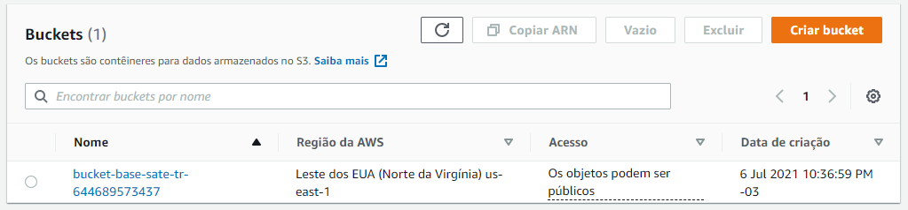
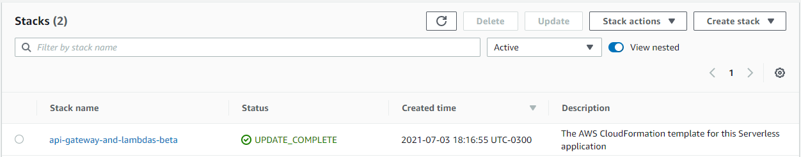
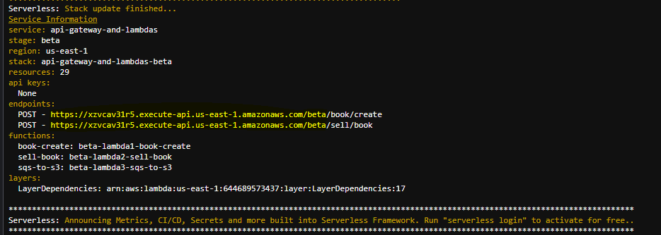
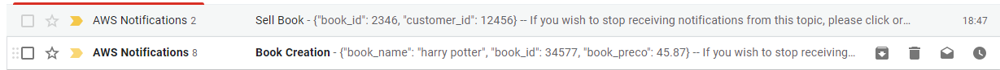

# AWS ARCHITECTURE

Projeto feito com o objetivo de criar uma infra como código na AWS Cloud utilizando [Terraform](https://www.terraform.io) e [Serveless Framework](https://www.serverless.com).

---
---
# Motivador

- [PROBLEMA PROPOSTO](./DESAFIO_PROPOSTO.pdf)

---
---
# Arquitetura do projeto


---
---

# Passos para execução do projeto

## Criar ambiente

Siga as instruções [deste repositório](https://github.com/vamperst/Hackaton-exercises-terraform/tree/master/Setup%20e%20Configura%C3%A7%C3%A3o) para montar seu ambiente no **Cloud9** juntamente com a instalação do **Terraform** e **Serveless Framework**.

## Subir projeto

Assim que tiver seu ambiente montado siga as instruções abaixo:

### Clone do repositório

1. Volte para a pasta raiz do cloud9 `cd ~/environment`
2. Clone este projeto `git clone https://github.com/marciojg/aws-architecture.git`
3. Entre na psta do projeto `cd aws-architecture`


### Subir Bucket S3 para guardar o estado do terraform

4. Entre na pasta 'S3' com o comando `cd terraform/S3`
5. Execute o comando `terraform init`
6. Execute o comando `terraform apply -auto-approve`
7. Saia da pasta com `cd ..`



### Subir SNS, SQS, Bucket/S3 suas subscrições e políticas

8. No arquivo `vars.tf` substitua `<EMAIL-AQUI>` pelo seu email
9. Execute o comando `terraform init`
10. Execute o comando `terraform apply -auto-approve`


### Subir Lambdas e API Gateway e suas conexões

11. Vá para a pasta serveless `cd ../serveless`
12. Crie uma pasta chamada `layer` utilizando o comando no terminal `mkdir layer`
13. Execute os comandos abaixo para instalar todas as dependencias listadas no arquivo `requirements.txt` dentro da pasta layer.

```bash
  python3 -m venv ~/venv
  source ~/venv/bin/activate

  pip3 install -r requirements.txt -t layer

  deactivate
```

14. No arquivo `serveless.yml` substitua `<ARN-SNS-AQUI>` pelo ARN do SNS criado pelo terraform com o nome **sns-1-topic**.
15. No arquivo `serveless.yml` substitua `<ARN-SQS-AQUI>` pelo ARN do SQS criado pelo terraform com o nome **sqs-1-queue**.
16. Fazer deploy `sls deploy`
17. Acesse seu email usado no SNS endpint e confirme a inscrição a partir do email recebido do SNS, conforme imagem abaixo





---
---

## Testar projeto

Dados válidos para request

```json
// /book/create

{
 "book_name":"harry potter",
 "book_id": 34577,
 "book_preco": 45.87
}
```

```json
//  /sell/book

{
 "book_id":2346,
 "customer_id": 12456
}
```

Os testes podem ser feitos diretamente pelo API Gateway que possui uma interface de testes ou usando curl diretamente do console do Cloud9.

Caso decida fazer os testes usando o curl o endereço das APIs podem ser capturados logo após executar o comando `sls deploy`.



### Request válida

Quando enviamos uma request válida, a api retorna 200 e um arquivo será criado no bucket. Ex:





---

### Request Inválida

Quando a request é inválida um erro 400 é retornado e no log é exibido o atributo que está errado


---
---
## Destruir projeto

18. Serveless down

```bash
cd ~/environment/aws-architecture/serveless/
sls remove --force
```

19. Terraform down

```bash
cd ~/environment/aws-architecture/terraform/
terraform destroy --force
```
---
---

## Links úteis

- https://github.com/serverless/examples
- https://github.com/vamperst/Hackaton-exercises-terraform
- https://github.com/vamperst/Hackaton-exercises-serverless
- https://registry.terraform.io/providers/hashicorp/aws/latest/docs/resources/sqs_queue
- https://registry.terraform.io/modules/damacus/sqs-with-dlq/aws/latest
- https://www.serverless.com/framework/docs/providers/aws/events/apigateway/
- https://www.serverless.com/blog/aws-lambda-sqs-serverless-integration
- https://registry.terraform.io/providers/hashicorp/aws/latest/docs/resources/sns_topic_subscription
- https://registry.terraform.io/providers/hashicorp/aws/latest/docs/resources/sns_topic
- https://christiangiacomi.com/posts/terraform-sns-sqs-lambda/
- https://github.com/vamperst/desbravando-erros-e-falhas-em-territorio-serverless-demo
